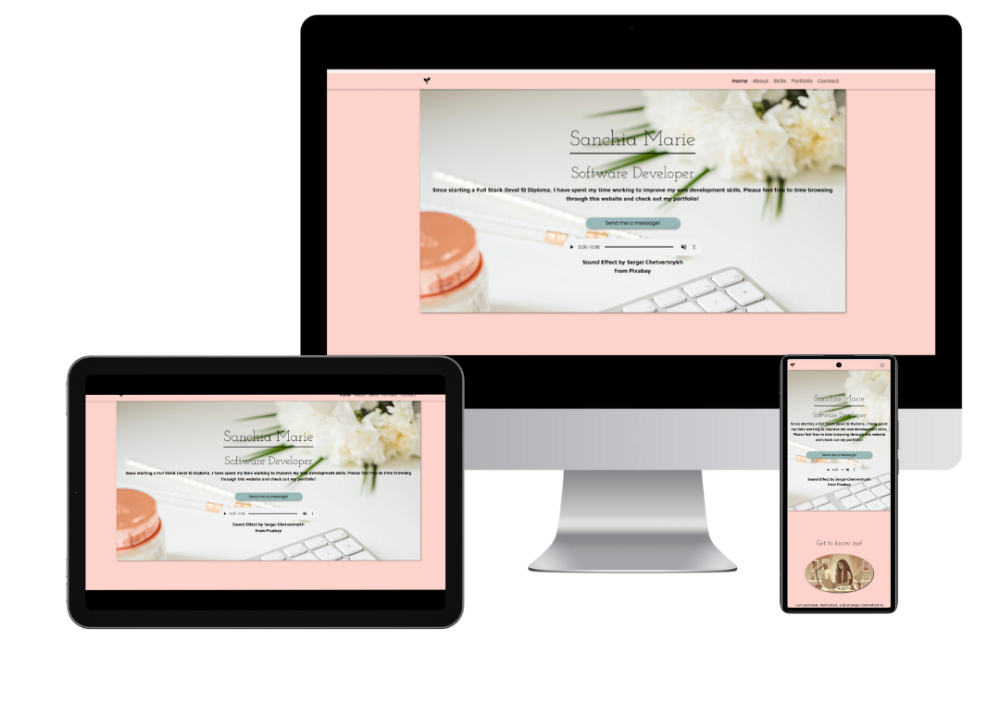
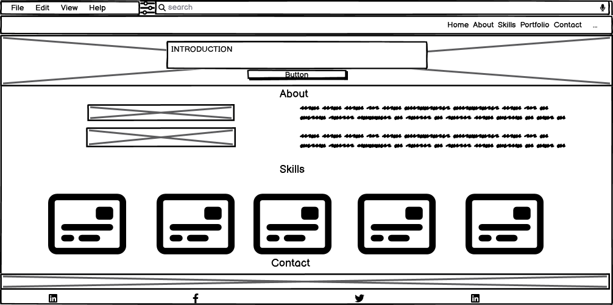
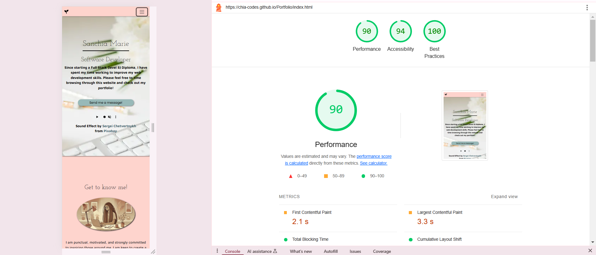
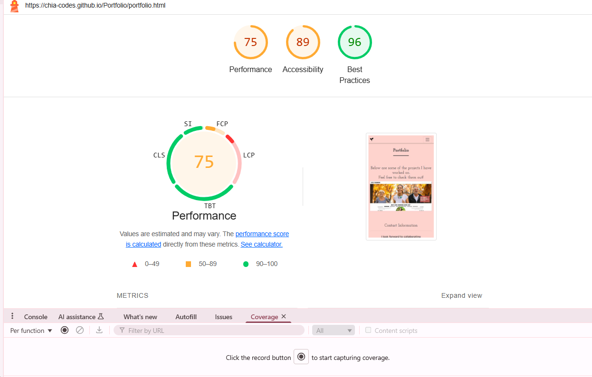
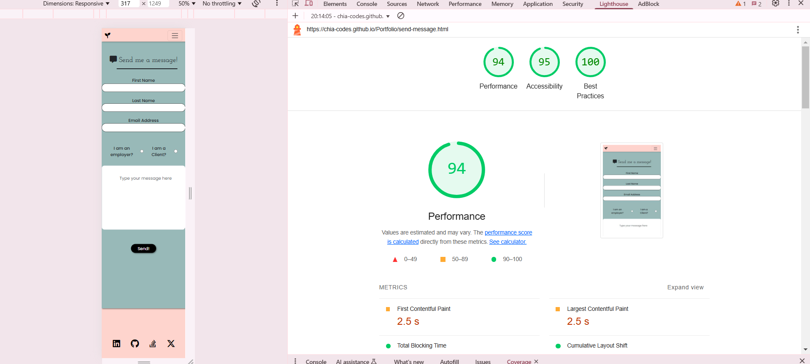
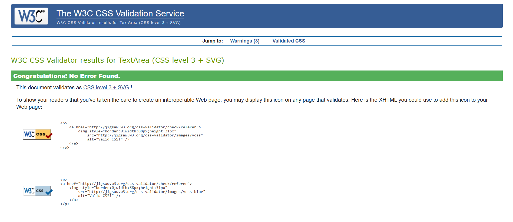

# Portfolio

My portfolio is a website to showcase my web development skills, experience and projects. The site is designed to inform potential recruiters and clients about myself and for them to be able to explore my work. It is a digital resume allowing users to be interactive and connect with me about work opportunities. 
View the live site [here](https://chia-codes.github.io/Portfolio)

## User Stories
These are five user stories followed used as a target audiunce to build my portfolio.

#### Story #1: 
As a First-Time Visitor, I need easy navigation and a user-friendly design. This includes a responsive layout for my device, so I can find information quickly and efficiently.
#### Story #2: 
As an employer, I want to see high-quality images, detailed descriptions in the about me section, with key skills and projects so i can decided if this is the right person to hire.
#### Story #3: 
As an hiring manager, I want to see a real or sample projects, so that I can evaluate the candidate technical abilities.
#### Story #4: 
As a potential client, I want to find contact information easily, so that I can reach out for potential work opportunities.
#### Story #5: 
As a client, I want to easily send a messagwe, to share my contact details and infomation reguarding my inquiry.

## Goals
- **Recruiters**: Provide a showcase of my skills and contact information on a site that is easy to navigate.
- **Me**: Increase chanes of getting hired.

## Features 

### Site wide
**Navigation**
* Responsive on all devices, the navigation menu will direct you to different pages throughout the site. 
* This allows users to easily navigate between different pages and sections within the site.  

**Header**
*  The header is the beginning of my portfolio journey as a user, featuring my name, and a short introduction.
*  The header contains a background image, ensuring engagement for the first impression of the site.
*  A call-to-action button is included, allowing user to easily navigate to the ‘send me a message’ page for direct contact.

**Footer**
* The footer includes icon links to my social media platforms, allowing users to connect across relevant platforms.
* The footer contains contact information, so users can reach out directly.
* The footer includes google maps, display my base location, for users to be informed of my whereabouts.

**Favicon**
* A customed favicon is used in the browser tap for site branding.
* This will allow the user to easily identify the site in their browser.

### Landing Page
**Home page**
* Utilising recommended guidelines, the site follows  WCAG 2.1, reassuring accessibility throughout the site.
* To contain 'about me' section for the user to learn about me and my work history.
* To showcase my relvant skills set, this will contain a skills card sections.

## About 
 

## Skills
 

**Contact form**
* Allows users to easily reach out and send me a message. The form will consist of the following fields and attributes: 
* First Name (required, type=text)
* Last Name (required, type=text)
* Email (required, type=email)
* Radio button options (required)
* Message (required, type=textarea)
* Successfully submitting the contact form, users will be redirected to success.html displaying a ‘thank you’ message.
* A radio button is included for clarity of inquiries, stating weather the user is a client or employer.
  
## Message Form
 

### Portfolio Page
**Portfolio**
* Portfolio page showcases projects worked on with relevant links to site repository and deployment. Clicking on links allows users to see projects in more detail.
* Each project is displayed on a carousel with captions to inform the user about the imagery.
* This allows users to browse through past projects and see my obtain knowledge and skills in action.  
 

### Existing Features

* Responsive content
* Hidden internal page
* External frameworks
* Imported google fonts and map

### Features Left to Implement

* To enhance the use of the site, contact form could be set to directly send message to email with a pop ‘success’ modal.
* Testimonial page could be added:
  - **User Story**: As a potential employer, I want to read references and reviews from other clients, so I can gauge the experiences of others and feel more confident about hiring.

## Design

### Wireframes
 

## Home page

 

 

 

  

  
## Send message form submission page

 

 

 
 

## Portfolio page
  

 
 
 
 

## Technologies
**Languages**
* HTML
    * To build structure and develop the Website.
* CSS3
    * To customise and style site with CSS in an external file.
**Frontend Framwork**
*Bootstrap V5.3
    * To lay foundation and structure to card section and navbar.
**IDE**
* Visual Studio Code
    * The website was created and developed using VS Code.
**Host**
* GitHub
    * Source of the code is hosted on GitHub and deployed using Git Pages.
**External Design**
* Font Awesome
    * Icons obtained from https://fontawesome.com/ used in social media section.
* Favicon.io
    * Favicon files were customised created at https://favicon.io/favicon-converter/ 
**Images**
* Squoosh
    * https://squoosh.com/ was used to reduce the size of the images used throughout the website.
* Balsamiq
    * Website wireframes were created using balsamiq https://balsamiq.com/wireframes/desktop
## Testing
Chrome DevTools was used throughout development and testing the deployed website to check for accessibility issues.

Testing was focused on the following criteria:

- All forms have associated screen-read tags to ensure accessibility of the visually impaired. 
- Heading are not missed or skipped to show importance and meaning of content.
- All images and media content has alternative descriptive text for screen readers.
- Making sure WCAG 2.1 recommended coding practices are being followed.

### Responsiveness

All pages were tested to ensure responsiveness on screen sizes from 320px and upwards on Chrome, Edge, and Firefox.

Steps to test:

1. Open browser and navigate to [Portfolio](https://chia-codes.github.io/portfolio)
2. Open the developer tools (right click and inspect)
3. Set to responsive and decrease to 320px
5. Click and drag the responsive window back and forth to minimum and maximum width.

Expected:

Website is responsive on all sizes and no images are stretched.
No horizontal scroll is present.
No elements overlap.

Actual:

Website behaved as expected with the exception of overlapping unreadable content from navbar dropdown menu and header overlapping ‘About me’ section.

Website was also opened on the following devices and no responsive issues were seen:

- Samsung Galaxy S23
- Amazon Tablet
- iPhone 13
- Dell Desktop-AH44THS

### Accessibility & Responsiveness Issues & Fixes
Manual tests were performed to identify problematic issues, they are as follows:

#### Issue #1: Navbar Clear Did Not Close on Click
- **Problem**: The navigation menu remained opening when clicking on skills section and background on items not visable.
- **Fix**: This was fixed implmenting a javascript query before the body closing tag (</body>) fo navbar to be responsive collapsing on mobile devices.

#### Issue #2: Large Images Impacting Loading Time
- **Problem**: Image files where holding excessive data increasing loading time during performance.
- **Fix**: Compressed all image files from ‘png’ to ‘webp’ using squoosh. 

#### Issue #3: Header Image Was Not Present on Mobile
- **Problem**: The header background image was taking too long to load, leading to poor user experience.
- **Fix**: `preload` used to load the background image early saving load time. As sugested by chrome developers this is a useful tag for important elements to increase load time. 

#### Issue #4: Fonts Loading Slowly
- **Problem**: Imported Google Fonts were slowing down performance.
- **Fix**: Added `<link rel="preconnect"…>` and preloaded fonts using `<link rel="preload">` to the head. This will insure the preffered font styles are preloaded to speed up page load and enchancing user experience.

#### Issue #5: Unused CSS Cause Slow Performance
- **Problem**: Styles in the CSS file were not being utilised, slowing down load time.
- **Fix**: Used Chrome DevTools – Coverage to manually find & remove unused CSS

#### Issue #5: Caousel Captions Not Present On Small Devices
- **Problem**: Carousel captions are not visible on small devices.
- **Fix**: Add links below carousel to avoid user inefficiency.

#### Issue #6: Breathing Space
- **Problem**: No breathing space for map & header.
- **Fix**: Add 'padding' & 'margin' in CSS styesheet throughout document for consistency and pleasant user experience.

#### Issue #7: Navbar Bold On Active Page
- **Problem**: Navbar items within index html page are not bold when user is on that section.
- **Fix**: Add 'padding' & 'margin' in CSS styesheet throughout document for consistency and pleasant user experience. 

## Lighthouse Testing Before Fixes

#### Home
 

#### Send Message

#### Portfolio
 

# Lighthouse Testing After Fixes

#### Home Page
 

#### Send Message Page

#### Potrfolio Page

### Functional Testing

**Navigation Links**

Testing performed to make certain all nav links navigate to the correct pages and sections. This was done by clicking on the navigation links on each page.

| Navigation Link | Page to Load    |
| --------------- | --------------- |
| Home            | index.html      |
| About       | about.html |
| Skills         | skills.html    |
| Potrfolio         | portfolio.html    |
| Contact         | send-message.html    |

Links on all pages navigated to the correct pages and section as expected.

**Form Testing**

The form on the home page tested to verify it functioned as expected when correct data was input and when incorrect data was input. 
The following test conducted:

_Scenario One - Correct Inputs_

Steps to test:

1. Navigate to [Portfolio - Home Page](https://chia-codes.github.io/portfolio/index.html)
2. Scroll down to ‘send me a message’ in header’:
3. User will be redirected to [Portfolio – Message Page](https://chia-codes.github.io/portfolio/send-message.html) then input:
   - First Name: Mary
   - Last Name: Anne
   - Email: email@test.com
   - Select any option for radio buttons
   - Comment: This is a test.
3. Click Submit
4. User should be redirected to success.html a confirmation page

Expected:

Form submits with no errors and user is redirected to success.html 

Actual:

No errors present and user is redirected to success.html

_Scenario Two - Missing Any Text Field_

Steps to test:

1. Navigate to [Portfolio - Home Page](https://chia-codes.github.io/portfolio/index.html)
2. Scroll down to ‘send me a message’ in header’:
3. User will be redirected to [Portfolio – Message Page](https://chia-codes.github.io/portfolio/send-message.html) then input:
   - First Name: Mary
   - Last Name: 
   - Email: email@test.com
   - Select any option for radio buttons
   - Comment: This is a test.
3. Click Submit
4. User should be prompted to fill in missing field.

Expected:

The form does not submit and a pop-up is displayed to tell the user that the field is required.

Actual:

Behaved as expected, pop-up message displayed and form did not submit.

_Scenario Three – Radio Buttons Left Empty_

Steps to test:

1. Navigate to [Portfolio - Home Page](https://chia-codes.github.io/portfolio/index.html)

2. Scroll down to ‘send me a message’ in header’:
3. User will be redirected to [Portfolio – Message Page](https://chia-codes.github.io/portfolio/send-message.html) then input:
   - First Name: Mary
   - Last Name: Anne
   - Email: email@test.com
   - Do not select options for radio buttons
   - Comment: This is a test.
3. Click Submit
4. User should be informed radio buttons options are required.

Expected:

The form does not submit and pop-up is displayed to tell the user that an option is required.

Actual:

Site behaved as expected and pop-up message to pick and option is present.

_Scenario Four - Wrong Email Format_

Steps to test:

1. Navigate to [Portfolio - Home Page](https://chia-codes.github.io/portfolio/index.html)

2. Scroll down to ‘send me a message’ in header’:
3. User will be redirected to [Portfolio – Message Page](https://chia-codes.github.io/portfolio/send-message.html) then input:
   - First Name: Mary
   - Last Name: Anne
   - Email: email----test.com
   - Select any option for radio buttons
   - Comment: This is a test.
3. Click Submit
4. User should be informed email is invalid and to input correct format.

Expected:

The form does not submit and a pop-up is displayed to tell the user that the field is not valid.

Actual:

Website behaved as expected, expected pop-up message was displayed and the form did not submit.

**Footer Social Media Icons / Links**

Testing for social media icons was performed to make certain links direct to the correct sites, open in a new tab and has hover effect to reassure the user that it’s a link. 
Each item did opened a new tab when clicked as expected and change in color when hovered was present. All links lead to expected sites. 

**Footer Contact Information**

Testing in the contact section was performed to make certain the user can reach out directly though the site. Phone number to prompt a call action from mobile devices and email to open email application across any device.

_Steps to test Telephone Number_

1. Navigate to [Portfolio - Home Page](https://chia-codes.github.io/portfolio/index.html)
2. Click the contact in navbar or scroll to number in the footer (0208 726 9958)

Expected:

On mobile pop-up should be displayed to call selected number.

Actual:

Behaved exactly as expected and prompted the user to make a phone call with selected number.

_Steps to test Email_

1. Navigate to [Portfolio - Home Page](https://chia-codes.github.io/portfolio/index.html)
2. Click the contact in navbar or scroll to email in the footer (SanchiaN-L@hotmail.co.uk)

Expected:

An email application displays itself with target email address in ‘TO’ section ready to send email. 

Actual:

Behaved as expected and opened a Microsoft application on desktop and outlook app on mobile with target address in ‘send to’ section. 

### Validator Testing 

- HTML
  - 4 Errors found with wrong tag issues as displayed in image below

 

Fix: Remove unnecessary tags. 

- CSS
  - No errors were found when passing through the official [(Jigsaw) validator]( https://validator.w3.org/)

 

### Unfixed Bugs
#### Issue #1: Caousel Captions Not Present On Small Devices
#### Issue #2: Google Map Not Responsive
#### Issue #3: Navbar Not Closing After Clicking Skills Section

## Deployment

### Deployment to Github Pages
The portfolio website deployed using **GitHub Pages** 

### Steps to Deploy:
1. Sync files to a GitHub repository from VS Code.
2. Go to the **Settings** tab in the repository.
3. Scroll down to the **Pages** section.
4. Under **Branch**, select `main`
5. Click **Save**.
The live link can be found here - https://chia-codes.github.io/portfolio

## UX & UI Considerations
This website is buit with a 'mobile first' thought pattern. As most online users are highly likey to view the sight through a mobile or tablet, a mobile first approach is essential to the user experience.
The design follows the five planes of UX design:
1. **Strategy** – Set user needs and goals to ensure the site serves the recruiter and site manager.
2. **Scope** – Contain features such as the about, skills, and portfolio sections.
3. **Structure** – Design a logical easy-to-use structure that invitews easy navigation and ease of access.
4. **Skeleton** – Create wireframes to brainstorm and map out the layout the site.
5. **Surface** – Develop an appealing unique site with an elegant color scheme and subtle design elements.

## Credits 

* [Bootstrap](https://getbootstrap.com/)
    * Code was used from this site used to create structural foundtation of navbar and cards custmoised to my relevant preferences and ensure syncrinicity of styling throughout the site.
    * Also bootstrap was useful for providing Javascript code in order for functional & responsive structure, in this case collapsing navbar on click in mobile view. 
* [Javascript](https://javascript.com/)  
    * Javascript also deserve ceditation as it was used in conjustion with bootstrap 5.3
* [Squoosh](https://www.squoosh.com)
    * Was used to compress files, coverting them from png to webp increasing site load time.
* [Code Institute](https://learn.codeinstitute.net)
    * Code institute resorces including my mentor (Gareth Mcgirr) help with structural elements and how to code for prefered results.
   - The codes used were learnt in walkthrough projects shown in on the poject potrfolio page then implemented in this project.
   - Adding bootstrap framwork to html document
   - Learning to add JS to the document in order for bootstrap functions to be coherent.   
* [W3 Schools](https://www.w3schools.com)
    * Used to learn, reference and discover code elements to help build site. In this website 'w3-container' & 'loading'
* [Slack](https://slack.com/intl/en-gb/)
    * Slack was used to discuss code, fix hosting and connecting issues and gain feedback on written code.
* [Stackoverflow](https://stackoverflow.com//intl/en-gb/)
  This includes:
  - 'd-block' associated with the 'courasel caption' an attempt to debug caption's dissapearing on small devices. A another possible attempt for this is to implement display options.           https://stackoverflow.com/questions/42451739/bootstrap-4-carousel-caption-is-not-visible-on-small-device
  - Learn how others remove border from buttons https://stackoverflow.com/questions/11497094/remove-border-from-buttons
* [Google](https://www.google.com)
    * Google fonts used for styling throughout the website https://fonts.google.com/
    * Google maps used to embbed a location and interactive feature in the footer.
    * Chrome Developers used to read, discover and learn how different codes used, for this website implementing 'preload' & 'preconnect' https://developer.chrome.com/docs/devtools/application/debugging-speculation-rules
    * Chrome DevTools, lighthouse used to test and examin code performance and accessibility.

### Media

* [Pixabay](https://pixabay.com/)
    * Was used to discover royalty free audio embedded in the heade, audio credit goes to Sergei Chetvertnykh from pixabay. 
* [OpenAI](https://www.openai.com)
    * Used to generate personalised and custom imagery throughout the website. 

**Thank You!**
This is the first project I have created using my knowledge and skills gain from particpating in Code Institues Full Stack Diploma Course. 
I am aware there are issues and bugs within the site, and I aim to learn to fix them before my course date ends (Nov 2025) 
My 'commits' and changes could have more clarity with aim to make a selected changes rather than multiple. 
Thank you for taking the time to look through my first solo project!
